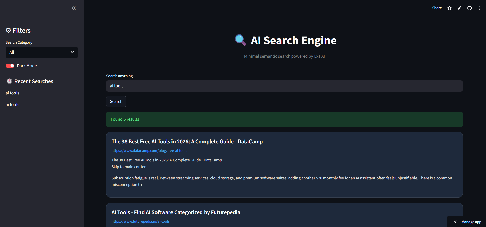

# 🔍 AI Exa Semantic Search Engine


A modern AI-powered semantic search engine built using **Exa API** and **Streamlit**, designed to deliver intelligent search results with domain filtering, summaries, and an interactive user experience.

---

## 🚀 Live Demo

🔗 https://ai-exa-semantic-search-engine.streamlit.app

---

## ✨ Features

* 🔎 Semantic AI Search using Exa API
* 📄 Search Result Summaries
* 🌐 Domain-Based Filtering
* 📰 Search Categories (GitHub / Research Papers / News)
* 🌙 Dark Mode Toggle
* 🕘 Search History
* 🎨 Modern Interactive UI with Hover Cards

---

## 🖥️ Preview

> Add your screenshot file in the repository as **screenshot.png**

```markdown

```

---

## 🛠️ Tech Stack

* Python
* Streamlit
* Exa API
* dotenv

---

## 📂 Project Structure

```bash
ai-exa-semantic-search-engine/
│── app.py
│── main.py
│── requirements.txt
│── README.md
│── .gitignore
│── screenshot.png
```

---

## ⚙️ Installation

```bash
git clone https://github.com/AyushKK31/ai-exa-semantic-search-engine.git
cd ai-exa-semantic-search-engine
pip install -r requirements.txt
```

---

## 🔑 Environment Setup

Create a `.env` file in the root directory:

```env
EXA_API_KEY=your_api_key_here
```

---

## ▶ Run Locally

```bash
streamlit run app.py
```

---

## 📌 Search Categories Supported

* GitHub
* Research Papers
* News
* General Web Search

---

## 🚀 Future Enhancements

* Search suggestions
* Export results to PDF
* Voice search
* Multi-domain search

---

## 👨‍💻 Author

Built by Ayush ✨
